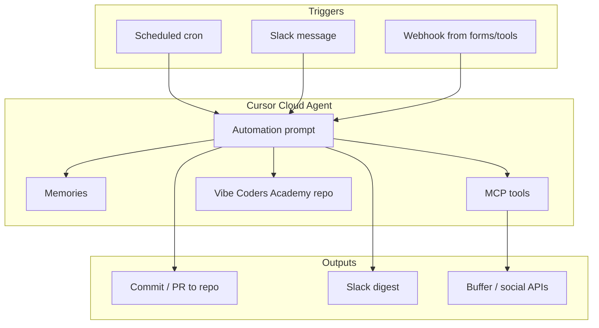

# Cursor Automations Playbook

**For:** Vibe Coders Academy course business  
**Last updated:** 2026-05-22  
**Sources:** [Cursor Automations docs](https://cursor.com/docs/cloud-agent/automations), [changelog (Mar & May 2026)](https://cursor.com/changelog), [announcement blog](https://cursor.com/blog/automations), marketplace templates, MCP ecosystem research.

---

## 1. What Cursor Automations are

**Cursor Automations** are always-on **cloud agents** that run in the background when a **trigger** fires. Each automation has:

1. **Trigger(s)** — schedule (cron), Slack message, GitHub/GitLab PR event, Linear issue, PagerDuty, Sentry, or **custom webhook**
2. **Prompt** — instructions (same style as a cloud agent task)
3. **Tools** — built-in (Slack, PR comment, open PR, memories) plus **MCP servers**
4. **Repository mode** — none, single repo, or **multi-repo**

They run in an **isolated cloud sandbox** (full VM with browser/computer use for verification), bill as [cloud agent usage](https://cursor.com/docs/models-and-pricing#model-pricing), and can **learn across runs** via the **Memories** tool.

**Where to create them**

- [cursor.com/automations](https://cursor.com/automations)
- **Agents Window** (Cursor 3+) — same workspace as local/cloud agents
- [Cursor Marketplace → Automations](https://cursor.com/marketplace/automations) — templates to fork

**Not the same as**

| Mechanism | When to use |
|-----------|-------------|
| **Automations** | Recurring or event-driven background work |
| **Hooks** (`hooks.json`) | Observe/control the **local** agent loop (before shell, after edit, etc.) |
| **Rules** (`.cursor/rules/`) | Persistent context inside any chat/agent in this repo |
| **SDK** (`@cursor/sdk`) | Your own scripts, CI, or bots calling agents programmatically |

For this business, **Automations + this git repo + rules** is the core operating model.

---

## 2. Architecture for our business



**Recommended split**

| Workflow | Repo attached? | Why |
|----------|----------------|-----|
| Daily standup prep | **Yes** — this repo | Read/write `planning/`, `research/` |
| Competitor analysis | **Yes** or **No** | No-repo if only MCP + web; repo if saving reports |
| Business plan drafts | **Yes** | Versioned markdown in `business/` |
| Social content | **No-repo** + MCP | Posting APIs; optional repo for drafts only |
| Landing page code | **Yes** — `web/` | Open PRs when we have GitHub connected |

---

## 3. Triggers (reference)

| Trigger | Use for us |
|---------|------------|
| **Scheduled (cron)** | Morning standup prep, weekly competitor scan, weekly metrics digest |
| **Slack — new message** | “@cursor research X”, FAQ bot, triage channel |
| **Webhook** | Form submissions, Notion button, n8n/Zapier, course waitlist |
| **Linear** | Issue created → research task (when we use Linear) |
| **GitHub/GitLab** | PR opened on `web/` — review landing page changes |

**Webhook auth:** Save the automation first; Cursor generates a **private URL + API key**. POST to trigger a run (Bearer token in `Authorization` header per docs). Regenerate the key if you change automation scope to **Team Owned**.

**Slack note:** Only **public channels** are visible to Slack triggers today.

---

## 4. Tools (reference)

| Tool | Business use |
|------|----------------|
| **Send to Slack** | Daily digest, alerts, “ready for review” |
| **Read Slack channels** | Context before replying or summarizing |
| **MCP server** | Notion, Buffer, LinkedIn, web search, Stripe later |
| **Memories** | Competitor list, brand voice, pricing decisions — **review periodically** (untrusted input can poison memory) |
| **Open pull request** | Website/code changes in `web/` |
| **Comment on PR** | Code review automation |

**Cloud agent extras:** web search, terminal, computer use (browser), artifacts (screenshots). HTTP MCPs are **recommended** over stdio for secrets (credentials stay on Cursor backend).

---

## 5. Mapping your four goals → automations

### 5.1 Daily standup & project management

**Pattern:** Scheduled morning agent + optional Slack trigger for ad-hoc “status”.

**Automation: `Morning standup prep`**

- **Trigger:** `0 8 * * 1-5` (weekdays 08:00 your timezone — adjust in UI)
- **Repo:** Vibe Coders Academy repo @ default branch
- **Tools:** Memories, MCP (optional Notion/Linear later), Send to Slack (optional)
- **Prompt sketch:**

```text
You are the PM for Vibe Coders Academy (solo course business).

1. Read planning/standups/ for the last 7 days and planning/TODO.md if it exists.
2. Read git log and open diffs since yesterday.
3. Produce today's standup in planning/standups/YYYY-MM-DD.md:
   - Done (since last standup)
   - Today (max 3 priorities)
   - Blockers / decisions needed from Denis
   - Suggested next actions for the agent
4. Update planning/TODO.md if priorities shifted.
5. Do not invent completed work; only cite files and commits you found.
6. If Send to Slack is enabled, post a 10-line summary to #vibe-pm.
```

**Automation: `Slack standup on demand`**

- **Trigger:** New message in `#vibe-pm` matching `(standup|status|daily)`
- **Repo:** same
- **Tools:** Read Slack, Send to Slack
- **Prompt:** Regenerate standup from repo + thread context; reply in thread.

**Human-in-the-loop:** Denis approves priorities in a 5-minute voice/chat review; agent executes the rest.

**Marketplace inspiration:** [Slack digest agent](https://cursor.com/marketplace) (no-repo template) — adapt for **your** channels + this repo.

---

### 5.2 Competitor deep analysis

**Automation: `Weekly competitor scan`**

- **Trigger:** Monday 09:00 cron
- **Repo:** Yes — write to `research/competitors/YYYY-MM-DD-<slug>.md`
- **Tools:** Web search (built-in), Memories, MCP (optional: browser/scrape via custom MCP)
- **Memories seed:** List 5–10 competitor names, URLs, and what to compare (pricing, curriculum, format, audience).

**Prompt sketch:**

```text
Run a structured competitor analysis for the online course businesses listed in Memories.

For each competitor:
- Offer & positioning (1 paragraph)
- Pricing / monetization (table)
- Content format (async, cohort, hybrid)
- Strengths vs us
- Gaps we can exploit
- Sources (URLs with dates)

Write research/competitors/YYYY-MM-DD-weekly.md.
Append only net-new findings vs last week's file; do not duplicate.
End with "Strategic recommendations" (3 bullets max).
```

**On-demand:** Webhook from a spreadsheet or Slack “research {name}” → same prompt, single competitor file.

**Quality bar:** Agent must cite URLs; flag low-confidence claims.

---

### 5.3 Business analysis & business plan

**Automation: `Business plan drafter`**

- **Trigger:** Webhook or Slack “draft plan” / monthly cron
- **Repo:** Yes — read `business/`, `research/`, write `business/plan-*.md`
- **Tools:** Memories (ICP, pricing hypotheses), MCP Notion if you keep canonical docs there

**Sections to enforce in prompt:**

1. Executive summary  
2. Problem & ICP  
3. Solution & curriculum outline  
4. Market size (TAM/SAM/SOM) — **state assumptions**  
5. Competition (link `research/competitors/`)  
6. Go-to-market  
7. Revenue model & unit economics  
8. 90-day roadmap  
9. Risks & mitigations  

**Automation: `Plan vs reality check` (monthly)**

- Compare `planning/` progress to `business/plan-*.md`; output variance report.

**Marketplace inspiration:** Product analytics / finance agents — when you have Stripe or a warehouse, swap Databricks for **Stripe MCP** + repo docs.

---

### 5.4 Social media posts + automatic posting

**Two layers:** (A) **create & review in repo**, (B) **publish via MCP**.

#### A — Content factory (repo)

**Automation: `Social content batch`**

- **Trigger:** Wednesday cron or webhook
- **Repo:** Yes — `content/social/YYYY-MM-DD/`
- **Prompt:** Generate 3–5 posts (LinkedIn, X, short video scripts) from latest `business/` and `research/`; follow brand voice in Memories; **do not post** — files only.

#### B — Publish (no-repo + MCP)

**Automation: `Schedule approved posts`**

- **Trigger:** Webhook when Denis marks posts approved (or manual run)
- **Repo:** **No-repo** (or read-only attachment)
- **MCP:** Buffer or multi-platform publisher

| MCP option | Platforms | Notes |
|------------|-----------|--------|
| [Buffer MCP](https://github.com/rodrigo-do-carmo/mcp-server-buffer) | X, LinkedIn, FB, IG via Buffer | `BUFFER_ACCESS_TOKEN`; `buffer_create_update`, queue tools |
| [LinkedIn Page Management MCP](https://vinkius.com/apps/linkedin-page-management-mcp/with/cursor) | Company page | `create_page_post`, OAuth via host |
| [Publora MCP](https://publora.com/blog/cursor-ai-social-media-post-to-10-platforms-from-ide) | 11 platforms | API key; scheduling from IDE |

**Recommended flow for safety**

1. Agent drafts → commit to `content/social/`  
2. Denis edits / approves in git or Slack reaction  
3. Second automation (or same with strict prompt) calls MCP **only if** file has frontmatter `approved: true`  
4. Log post IDs back into the markdown file  

**Prompt guardrails:**

```text
Never post without explicit approval marker in the source file.
Never post pricing or launch dates not present in business/approved-messaging.md.
Prefer schedule over immediate publish unless Denis says "post now".
```

---

## 6. High-value automations beyond the four goals

These come from Cursor’s own usage and marketplace templates — adapted for a **solo course business**.

| Automation | Trigger | Value |
|------------|---------|--------|
| **Slack digest** | Daily cron, no-repo | Unread DMs + key channels prioritized (template exists) |
| **Product FAQ agent** | Slack channel | Answer student questions from Notion/docs/repo |
| **Waitlist / lead triage** | Webhook (Tally, Typeform) | Summarize signups → `research/leads.md` + Slack |
| **Content repurposer** | After new lesson outline in repo | Turn outline → thread, carousel script, email |
| **SEO / landing copy reviewer** | PR to `web/` | Review copy, a11y, meta tags |
| **Weekly changelog** | Friday cron | What shipped in repo (for audience transparency) |
| **Invoice / revenue digest** | Monthly | Stripe MCP when live |

---

## 7. Repo + rules setup (this project)

### 7.1 Directory conventions

```
planning/
  TODO.md
  standups/YYYY-MM-DD.md
business/
  plan-v1.md
  approved-messaging.md
research/
  competitors/
content/
  social/
web/
.cursor/
  rules/
  mcp.json          # project MCP (Buffer, etc.)
docs/
  cursor-automations-playbook.md
```

### 7.2 Rules to add (`.cursor/rules/`)

| Rule file | Purpose |
|-----------|---------|
| `pm-assistant.mdc` | Standup format, never invent tasks, cite files |
| `brand-voice.mdc` | Tone for course + social |
| `competitor-research.mdc` | Citation requirements, comparison table schema |
| `social-guardrails.mdc` | Approval before publish, banned claims |

### 7.3 MCP configuration sketch

Project-level `.cursor/mcp.json` (when you have tokens):

```json
{
  "mcpServers": {
    "buffer": {
      "command": "npx",
      "args": ["mcp-server-buffer"],
      "env": {
        "BUFFER_ACCESS_TOKEN": "${BUFFER_ACCESS_TOKEN}"
      }
    }
  }
}
```

Enable the same MCPs on **cloud automations** in [cursor.com/agents](https://cursor.com/agents) → MCP dropdown.

---

## 8. SDK & webhooks (advanced)

When you outgrow UI-only automations:

- **`@cursor/sdk`** — `Agent.prompt()` for one-shot; `Agent.create()` + `agent.send()` for multi-turn ([SDK docs](https://cursor.com/docs/api/sdk/typescript))
- **Webhook trigger** — Your waitlist backend POSTs → competitor research automation
- **n8n / Make** — Bridge non-MCP SaaS into webhook → Cursor

Forum tip: webhook responses include a **run UUID**; if you wrap internal APIs in n8n MCP, pass that ID through for audit trails.

---

## 9. Security, cost, and ops

| Topic | Guidance |
|-------|----------|
| **Billing** | Private automations bill to creator; Team Owned uses team pool |
| **Secrets** | Never commit tokens; use env in MCP; HTTP MCP preferred in cloud |
| **Memories** | Powerful but can be manipulated by untrusted Slack input — review `MEMORIES.md` monthly |
| **Social posting** | Two-step approve; limit MCP tools to `create_update` not `delete` until trusted |
| **Models** | Haiku 4.5 noted as cheaper for automations (forum); use stronger models for business plan drafts |
| **Promo** | Check changelog for automation run discounts on new automations |

---

## 10. Implementation roadmap (suggested order)

| Week | Action |
|------|--------|
| 1 | Create `planning/TODO.md` + first standup file; rule `pm-assistant.mdc` |
| 1 | Automation: **Morning standup prep** (cron + this repo) |
| 2 | Seed Memories with competitors + ICP; automation: **Weekly competitor scan** |
| 2 | Template `research/competitors/_template.md` |
| 3 | Draft `business/plan-v1.md` manually; automation: **Business plan drafter** (monthly) |
| 4 | Buffer (or Publora) account + MCP; automation: **Social content batch** (draft only) |
| 5 | Approval workflow + **Schedule approved posts** |
| 6 | Connect GitHub when `web/` exists; PR review automation |

---

## 11. Quick links

- [Automations docs](https://cursor.com/docs/cloud-agent/automations)
- [Cloud agent capabilities](https://cursor.com/docs/cloud-agent/capabilities)
- [MCP docs](https://cursor.com/docs/mcp)
- [Hooks docs](https://cursor.com/docs/hooks)
- [Marketplace](https://cursor.com/marketplace)
- [Create automation](https://cursor.com/automations/new)
- [Blog: Build agents that run automatically](https://cursor.com/blog/automations)

---

## 12. First three automations to click “Create” today

1. **Morning standup prep** — cron weekday mornings, repo attached, write `planning/standups/`  
2. **Weekly competitor scan** — Monday cron, Memories seeded, `research/competitors/`  
3. **Social content batch (draft only)** — Wednesday cron, repo only, no MCP publish until week 5  

Copy prompts from §5 into the automation UI; enable **Memories** on 1 and 2.

When Denis is ready, we can use Cursor’s backend MCP (`build_automation_prefill_url`) to generate prefill links from reviewed JSON — after privacy/storage settings allow it.
