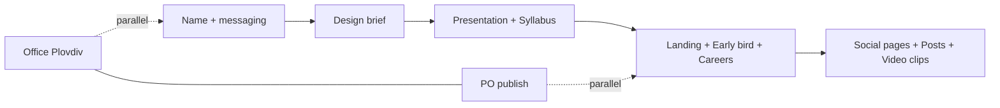

# Roadmap — Vibe Coders Academy course business

**Horizon:** Multi-week path (not a single-day sprint)  
**Updated:** 2026-05-27 — course name selected; `vibe-coders.academy` planned but not active yet.

## How we work

| Owner | Responsibility |
|-------|----------------|
| **Denis** | Decisions, approvals, accounts, recording, office visits, publishing when credentials are his |
| **PM / Agent** | Research, drafts, repo files, checklists, copy variants, build tasks in repo, standups |
| **Together** | Review in Slack thread → Denis marks approved in file or replies `approve` |

Daily standups still cap **Today** at 3 items pulled from this roadmap.

---

## Tracks (your 13 topics)

| # | Topic | Denis | PM / Agent |
|---|--------|-------|------------|
| 1 | **Office in Plovdiv** | Visits, lease, budget sign-off | Search criteria doc; listing shortlist; comparison table |
| 2 | **PO position — publish** | Final JD text; pick boards/channels; hit Publish | Format JD for web + social; publish checklist; draft announcement posts *(needs JD file in repo)* |
| 3 | **Course name** | Done: Vibe Coders Academy | Keep `business/approved-messaging.md` synced; brand/domain checks |
| 4 | **Social pages** | Create accounts (LinkedIn, FB, IG, etc.); verify | Bios, cover copy, first-post pack (draft) |
| 5 | **Design — logos, flyers, posters** | Brand direction, final approval, print/vendor | Creative brief; layout copy; template specs in `content/brand/` |
| 6 | **Landing page** | Copy + offer approval | Build `web/`; wire early bird when approved |
| 7 | **Our job ad on website** | PO text + apply method (email/form) | Careers page + SEO; link from landing |
| 8 | **Presentation** | Narrative sign-off; present/record if live | Deck outline + slide content in `content/presentation/` |
| 9 | **Social posts from presentation** | Approve which slides become posts | Repurpose plan + draft posts in `content/social/` |
| 10 | **Syllabus** | Module priorities, depth, what you teach live | Draft `content/syllabus-v1.md` from `business/plan-v1.md` |
| 11 | **Early bird on website** | Price, dates, capacity, legal wording | Implement section on landing; sync `approved-messaging.md` |
| 12 | **Video presentation** | Record on camera; final cut approval | Script, storyboard, B-roll list in `content/video/` |
| 13 | **Short clips for social** | Approve clips | Cut list + captions from #12 master video |

---

## Suggested phase order

| Phase | Focus | Unlocks |
|-------|--------|---------|
| **A — Identity** | #3 Name, #5 design direction | Everything customer-facing |
| **B — Story** | #8 Presentation, #10 Syllabus | #9, #12, #13 content |
| **C — Web** | #6 Landing, #11 Early bird, #7 Job page | #2 PO announcement, #4 social links |
| **D — Distribution** | #4 Social pages, #9 #13 social content | Audience + waitlist |
| **E — Ops** | #1 Office, #2 PO publish | Parallel; not blocking course launch |

---

## Near-term queue (PM picks 1–3 per day with Denis)

1. **#6** — Denis/Agent: activate or point `vibe-coders.academy` when DNS/hosting is ready
2. **#2** — Denis: confirm whether to proceed with PO/JD publishing or keep paused while competitor research runs
3. **#5** — Agent: creative brief + folder structure for brand assets
4. **#10** — Agent: syllabus v1 draft using Vibe Coders Academy positioning
5. **#8** — Agent: presentation outline after syllabus skeleton

---

## Repo locations (target)

| Asset | Path |
|-------|------|
| Roadmap | `planning/roadmap.md` |
| Master TODO | `planning/TODO.md` |
| Course name decision | `business/course-name-options.md` |
| PO job description | `business/jobs/product-owner.md` *(Denis to add)* |
| Syllabus | `content/syllabus-v1.md` |
| Presentation | `content/presentation/` |
| Brand / print | `content/brand/` |
| Landing | `web/` |
| Social drafts | `content/social/` |
| Video scripts | `content/video/` |

---

## Carried over (infra — not on the 13-topic list)

- `#vibe-inbox`, MCP Exa, automations 02–04 — when Denis wants agent research/drafts at scale
- `research/competitors/COMPETITORS.md` — now seeded with Bulgaria AI coding / vibe coding / agentic coding competitors
